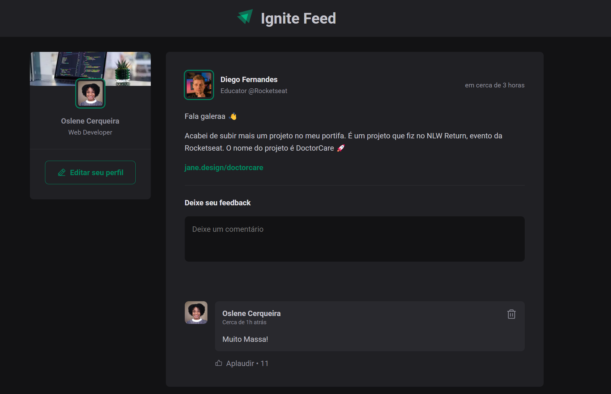

# # Ignite Feed




<div align="center">

[](https://react.dev/) [](https://vitejs.dev/) [](https://www.typescriptlang.org/) [](https://www.javascript.com/) [](https://developer.mozilla.org/pt-BR/docs/Web/HTML) [](https://www.w3schools.com/css/) 

</div>

<div align="center">
        <h2>
          <a href="#information_source-sobre">Sobre</a>&nbsp;|&nbsp;
          <a href="#seedling-requisitos-mínimos">Requisitos</a>&nbsp;|&nbsp;
          <a href="#rocket-principais-tecnologias-utilizadas">Tecnologias</a>
          &nbsp;|&nbsp;
          <a href="#package-como-baixar-e-executar-o-projeto">Baixar e Executar</a>&nbsp;
        </h2>
</div>


## :information_source: Sobre

- A ideia dessa aplicação é poder listar posts de um blog e os comentar de forma simples, sem muitas funcionalidades, apenas para praticar os conceitos básicos de React, Vite e TypeScript e a acessibilidade.
- Esse projeto tem o objetivo de praticar os conceitos básicos do desenvolvimento web com React, componentes, propriedades, variável Estado, manipulações de variável Estado, estilização básica com CSS e a aplicação de CSS modules, e formas de passar dados/funções para componentes criados, além de praticar o uso de TypeScript e boas práticas de acessibilidade com axe-core.
- É um projeto simples, mas que trata da base de uma aplicação web com React.

- Para a construção da interface desse projeto foi usado **[React](https://react.dev)** com **[TypeScript](https://www.typescriptlang.org/)**.
- A estilização é feita com CSS comum sem nenhuma lib por meio do **[CSS modules](https://github.com/css-modules/css-modules)** já que a ideia é entender o básico do React em desenvolvimento web.

- Temos funcionalidades e práticas como:
  1. Listar posts de um blog
  2. Criar comentários para esses posts
  3. Excluir comentários desses posts
  4. Melhoria de acessibilidade com testes e correções com axe-core e ChromeVox.
  5. Uso do Radix UI para construção de Modais com melhor acessibilidade
  6. Estilização com CSS modules
---

## :seedling: Requisitos Mínimos

  1. NodeJS
  2. React
  3. Vite
  4. NPM


## :rocket: Tecnologias Utilizadas

- O projeto foi desenvolvido utilizando as seguintes tecnologias:


  1. **[Date FNS](https://date-fns.org/)**
  2. **[JavaScript](https://developer.mozilla.org/pt1.BR/docs/Web/JavaScript)**
  3. **[Netlify](https://www.netlify.com/)**
  4. **[NodeJS](https://nodejs.org/en/)**
  5. **[Phosphor Icons](https://phosphoricons.com/)**
  6. **[React](https://pt1.br.react.dev/)**
  7. **[TypeScript](https://www.typescriptlang.org/)**
  8. **[Vite](https://vitejs.dev/)**

---


## :package: Como baixar e executar o projeto

### Baixar

- Clonar o projeto:

  ```bash
   git clone https://github.com/OsleneCerqueira/Ignite-feed.git
  ```

- É necessário ter o Node.js e um gerenciador de pacotes, como o NPM, instalados em seu sistema. Se você ainda não os tem, siga estas instruções:
  - [Instalação do NodeJS](https://nodejs.org/en/)
  - [Instalação do  npm](https://www.npmjs.com/get-npm)

- Instalação das dependências:
  - Execute o comando abaixo dentro da pasta do projeto

    ```bash
    npm install

    ```

### Execução

- Caso tudo tenha sido instalado com sucesso, basta executar na raiz do projeto:

  ```bash
      npm run dev
  ```

---

Desenvolvido por :star2: Oslene Cerqueira.